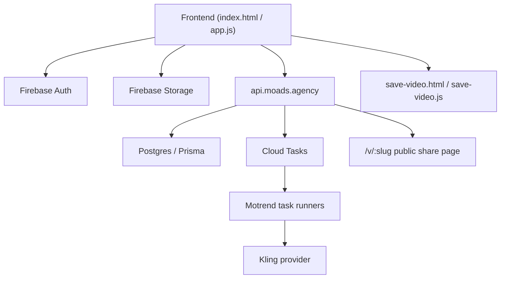

# MoTrend Technical Overview

Last updated: 2026-04-15 (Asia/Tbilisi)
Status: Beta v1 working snapshot

This document is the current Beta v1 handoff snapshot for MoTrend. It reflects the live architecture and the practical frontend/backend behavior that is actually in use now, not the older Firebase Functions-era design.

## 1. Snapshot

### Canonical frontend repo
- Path: `/Users/malevich/Documents/Playground/motrend`
- Branch: `feature/motrend-wallet-fastspring`
- Current committed anchor at snapshot start: `f83c45486708a3e7a14f8ca7c683256252f3bda8`

### Secondary local clone
- Path: `/Users/malevich/motrend`
- Branch: `main`
- Local-only sync target for docs and operational notes

### Backend repo
- Path: `/Users/malevich/Documents/Playground/moads-platform`
- Branch: `feature/motrend-wallet-fastspring`
- Current committed anchor: `844b6de7563907ad202519bc21b79bcb4be3f762`

### Live surfaces
- Main app: [https://trend.moads.agency](https://trend.moads.agency)
- API: [https://api.moads.agency](https://api.moads.agency)
- Health: [https://api.moads.agency/health](https://api.moads.agency/health)
- Public share route: `https://trend.moads.agency/v/<slug>`
- Save/watch fallback page: `https://trend.moads.agency/save-video.html?...`

### QA surfaces
- Firebase Hosting preview channels on the canonical site project are the frontend QA contour.
- Any `*.web.app` or `*.firebaseapp.com` frontend host now targets `https://api-dev.moads.agency` automatically.
- `api-dev.moads.agency` remains backed by dev Cloud SQL and test-mode payment wiring.
- Preview deploy command: `./deploy-preview.sh [channel-id]`

### Beta v1 runtime note
- Production contour is currently back on `DODO_ENVIRONMENT=live_mode`.
- Live Dodo secrets are restored as latest versions in GCP Secret Manager.
- Live Dodo product IDs are restored in the prod DB pack mapping.
- Current live API revision: `moads-api-00036-fgz`.
- Safe QA contour uses Firebase Hosting preview URLs + `api-dev.moads.agency` + dev Cloud SQL + `DODO_ENVIRONMENT=test_mode`.

## 2. Product Summary

MoTrend is a mobile-first web app that turns a user photo into a generated short-form video.

There are two user-facing creation modes:

1. Template mode
- The user selects a built-in trend.
- The backend uses the trend’s predefined motion reference.

2. Reference-video mode
- The user uploads their own motion reference video.
- The backend uses the uploaded reference for the final generation request.

Core product surfaces in Beta v1:
- Authentication
- User wallet and credit balance
- Trend selection
- Photo upload and generation start
- Job history
- Prepare/download/watch/share flow

## 3. Actual Tech Stack

### Frontend
- Static Firebase Hosting site
- Main app:
  - [/Users/malevich/Documents/Playground/motrend/public/index.html](/Users/malevich/Documents/Playground/motrend/public/index.html)
  - [/Users/malevich/Documents/Playground/motrend/public/app.js](/Users/malevich/Documents/Playground/motrend/public/app.js)
- Save/watch page:
  - [/Users/malevich/Documents/Playground/motrend/public/save-video.html](/Users/malevich/Documents/Playground/motrend/public/save-video.html)
  - [/Users/malevich/Documents/Playground/motrend/public/save-video.js](/Users/malevich/Documents/Playground/motrend/public/save-video.js)
- Plain JavaScript, no bundler
- Firebase Web SDK:
  - Auth
  - Storage
  - Analytics
- GTM container:
  - `GTM-N2W4DK23`

### Backend
- Shared Cloud Run API:
  - [/Users/malevich/Documents/Playground/moads-platform](/Users/malevich/Documents/Playground/moads-platform)
- Main active MoTrend routes:
  - `/auth/*`
  - `/motrend/*`
  - `/billing/*`
  - `/v/:slug` public share page

### Data / infra
- Firebase Auth
- Firebase Storage
- Firestore for limited client-owned state
- Postgres via Prisma in `moads-platform`
- Cloud Tasks for async job orchestration
- Kling provider path for real generation
- Dodo Payments for checkout

### Legacy note
- The local `functions/` package in this repo is no longer the active production backend.
- Historical references to callable Cloud Functions and trigger-based orchestration are legacy unless explicitly marked otherwise.

## 4. High-Level Architecture

Key design decisions:

1. Browser uploads files directly to Firebase Storage.
2. Backend is the source of truth for:
- jobs
- billing
- wallet balance
- public share state
- download preparation
3. Public sharing uses short links via `/v/<slug>`.
4. `save-video.html` remains the direct/open-safe fallback for browsers or share contexts that need explicit storage-backed URLs.

## 5. Current Frontend Behavior

### Main UI sections
In [public/index.html](/Users/malevich/Documents/Playground/motrend/public/index.html):

1. Brand and auth
2. User card
3. Trend picker
4. Generate form
5. Job history
6. Wallet / buy credits modal

### Important frontend state buckets
In [public/app.js](/Users/malevich/Documents/Playground/motrend/public/app.js):

1. Auth state
- current Firebase user
- platform bootstrap state
- whether auth panel should reopen after failed auth

2. Trend/generation state
- selected trend
- template vs reference-video mode
- upload context
- pending resume upload
- generation progress and latest job snapshot

3. Wallet state
- credit packs
- recent billing orders
- checkout in-flight lock

4. Share/download state
- cached prepared watch/download URLs
- public share URL cache
- preview URL cache

5. Attribution and analytics state
- GTM `dataLayer`
- standard UTM params
- click IDs:
  - Google / Ads
  - Meta
  - Yandex
- cookie-backed first-touch and last-touch storage

## 6. Authentication and Signup Rules

Supported auth methods:
- Email signup
- Email login
- Google sign-in

### Beta v1 auth behavior

1. Failed auth attempts reopen the auth panel on later visits.
2. Truly new browsers keep the signup-first layout.
3. Browsers with prior registration/auth traces bias the UI toward:
- primary: `Log in`
- secondary: `Create account`
4. New account creation is allowed even on a browser that previously registered another account.
5. The signup gift is currently `3` credits.

### Gift suppression

The gift is not purely cookie-based.

Beta v1 uses two layers:

1. Browser evidence
- prior auth success markers
- registration markers
- prior gift markers

2. Server-side suppression
- hashed fingerprint using normalized IP + coarse user-agent
- practical cooldown window to avoid repeat free-credit abuse from incognito/new cookie jars

Result:
- first clean signup gets `3` credits
- repeat signup on the same browser is allowed but gets no gift
- incognito/new browser on the same machine/network can also be denied the gift by server-side suppression

## 7. Generation Flow

### Template flow

1. User selects a built-in trend.
2. User uploads a photo.
3. Frontend creates a pending job.
4. Photo is uploaded to Firebase Storage.
5. Frontend finalizes the job.
6. Backend debits credits and queues provider work.
7. Async workers submit/poll provider state.
8. Completed jobs appear in history.

### Reference-video flow

1. User selects custom reference mode.
2. Reference video upload can begin before the final generate click.
3. Photo upload and job finalize happen after the user commits.
4. Stale pending uploads are auto-swept server-side if they time out.

### Important constraint for QA
- Do not spend real provider generations unless explicitly intended.
- Safe QA should stop at upload, checkout, share, or already-completed-job flows.
- Payment QA should run only on the Firebase preview / `web.app` frontend contour or other non-prod hosts that resolve to `api-dev.moads.agency`.

## 8. Billing and Wallet

Billing provider in Beta v1:
- Dodo Payments

Wallet frontend:
- implemented in [public/app.js](/Users/malevich/Documents/Playground/motrend/public/app.js)

Main wallet API routes:
- `GET /billing/credit-packs`
- `GET /billing/orders`
- `POST /billing/orders/checkout`

Current pack set:
- Starter: `30` credits
- Creator: `80` credits
- Pro: `200` credits

Beta v1 checkout notes:
- Dodo checkout is the active integration path
- short-term QA may point the runtime to Dodo `test_mode`
- current UX tries to minimize friction with:
  - `minimal_address: true`
  - restricted payment methods
  - preferred `USD` billing currency
- Dev-cloud/test contour should seed MoTrend credit packs with Dodo test product IDs, not the live pack IDs used in prod.

## 9. Share, Watch, Download

There are three important link types:

1. Public share link
- canonical user-facing share URL
- shape: `https://trend.moads.agency/v/<slug>`

2. Save/watch page URL
- direct/open-safe fallback
- shape: `save-video.html?videoUrl=...&downloadUrl=...`

3. Raw storage URLs
- Firebase Storage-backed media URLs
- used internally by watch/download flows and preview generation

### Beta v1 sharing rules

1. Public `Share` should prefer the short `/v/<slug>` URL.
2. `Copy URL` can remain the more direct/open-safe fallback.
3. If prepared artifacts expire but source still exists:
- user should see `Prepare download`
- after prepare succeeds, watch/download/share actions return

### Preview strategy

Current target order:

1. Stored generated preview image derived from the final video
2. Template preview image fallback for legacy jobs

Known Beta v1 caveat:
- iPhone/Safari can still be inconsistent when the page needs a preview before first playback and no stored generated preview is already available.
- The preferred long-term fix is to persist generated preview assets before the watch/share page opens, not to derive them lazily at open time.

## 10. Tracking

Beta v1 tracking stack:
- Firebase Analytics
- GTM `GTM-N2W4DK23`

Tracked event families:
- auth
- payment
- generation

Tracked identifier families:
- standard UTM params
- Google / Google Ads click IDs
- Meta identifiers
- Yandex identifiers

PII rule:
- raw email must not be sent into analytics payloads

## 11. Operational Notes

### Important files
- [/Users/malevich/Documents/Playground/motrend/public/app.js](/Users/malevich/Documents/Playground/motrend/public/app.js)
- [/Users/malevich/Documents/Playground/motrend/public/save-video.js](/Users/malevich/Documents/Playground/motrend/public/save-video.js)
- [/Users/malevich/Documents/Playground/motrend/firebase.json](/Users/malevich/Documents/Playground/motrend/firebase.json)
- [/Users/malevich/Documents/Playground/moads-platform/services/api/src/routes/billing.ts](/Users/malevich/Documents/Playground/moads-platform/services/api/src/routes/billing.ts)
- [/Users/malevich/Documents/Playground/moads-platform/services/api/src/routes/public.ts](/Users/malevich/Documents/Playground/moads-platform/services/api/src/routes/public.ts)

### Known beta constraints
- iPhone/Safari preview behavior can still lag if a stored generated preview is missing
- Dodo may still require country/address fields depending on region and tax rules, even with minimal address mode
- The secondary local clone is not the canonical implementation source

## 12. Source of Truth

For ongoing implementation work, treat these as canonical:

- frontend behavior:
  - [/Users/malevich/Documents/Playground/motrend/public/app.js](/Users/malevich/Documents/Playground/motrend/public/app.js)
- save/watch/share fallback page:
  - [/Users/malevich/Documents/Playground/motrend/public/save-video.js](/Users/malevich/Documents/Playground/motrend/public/save-video.js)
- billing backend:
  - [/Users/malevich/Documents/Playground/moads-platform/services/api/src/routes/billing.ts](/Users/malevich/Documents/Playground/moads-platform/services/api/src/routes/billing.ts)
- public share backend:
  - [/Users/malevich/Documents/Playground/moads-platform/services/api/src/routes/public.ts](/Users/malevich/Documents/Playground/moads-platform/services/api/src/routes/public.ts)
- billing DB logic:
  - [/Users/malevich/Documents/Playground/moads-platform/packages/db/src/billing.ts](/Users/malevich/Documents/Playground/moads-platform/packages/db/src/billing.ts)
- MoTrend billing defaults:
  - [/Users/malevich/Documents/Playground/moads-platform/packages/db/src/motrend-billing.ts](/Users/malevich/Documents/Playground/moads-platform/packages/db/src/motrend-billing.ts)
