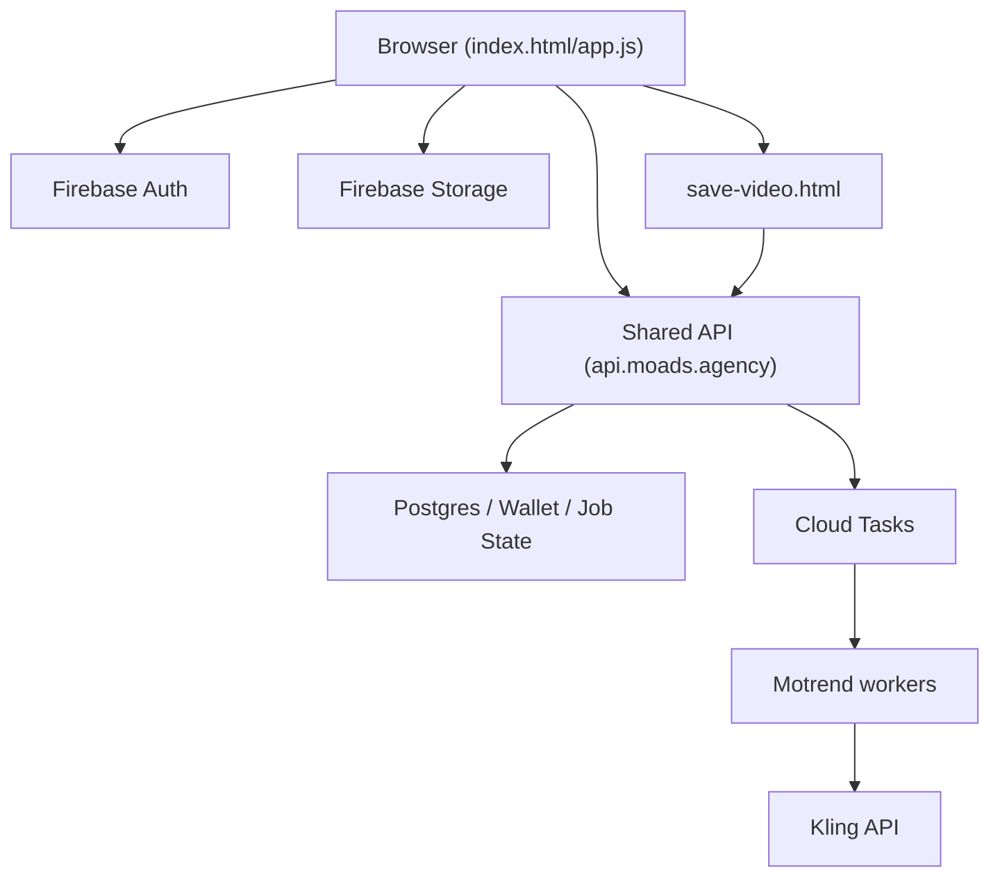
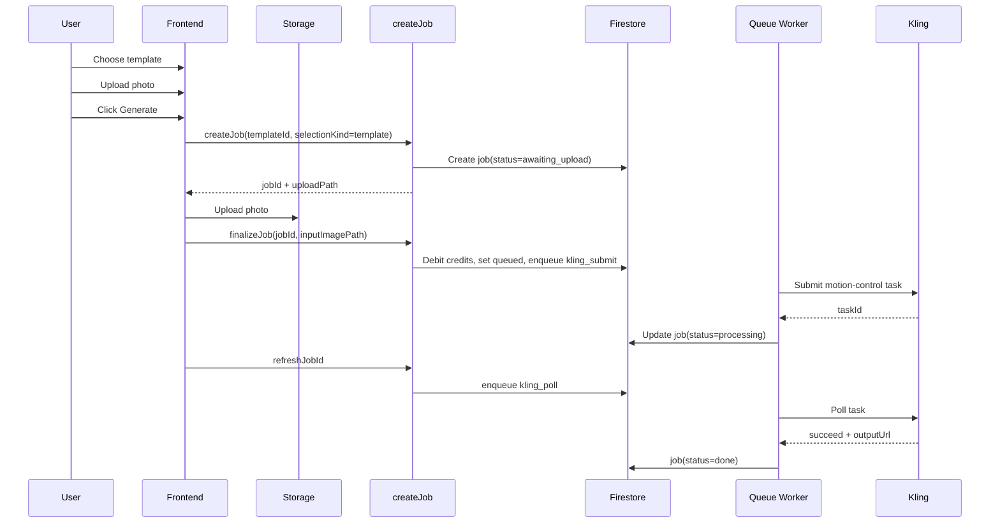

# MoTrend Technical Overview

> Status note (2026-04-04): production MoTrend no longer runs active business logic through the local Firebase Functions package in this repo. The live backend is the shared `moads-platform` API on `https://api.moads.agency`, and the local `functions/` package is retained only for utility tests/admin tooling. Historical references below to `createJob`, Firestore triggers, scheduled functions, and callable APIs are legacy unless explicitly updated.

This document is intended for a new developer or another AI agent that needs to understand how the project works across product behavior, frontend, backend, data model, billing, queues, and platform caveats.

## 1. Product Summary

MoTrend is a Firebase-based web app that turns a user photo into a short generated trend video.

There are two generation modes:

1. Template mode
   - User picks a built-in trend template.
   - The backend uses the template's reference motion video when submitting to Kling.

2. Reference-video mode
   - User uploads their own reference video.
   - The backend uses the uploaded video as the motion reference for Kling.
   - Billing is reconciled against the actual output duration after generation finishes.

Primary production surface:

- Main site: [https://trend.moads.agency/](https://trend.moads.agency/)
- Firebase Hosting origin: [https://gen-lang-client-0651837818.web.app](https://gen-lang-client-0651837818.web.app)

The project is optimized heavily for mobile browsers, including in-app browsers such as Telegram and Instagram, but some iOS limitations remain unavoidable.

## 2. Tech Stack

### Frontend

- Static Firebase Hosting site
- Main app:
  - [/Users/malevich/Documents/Playground/motrend/public/index.html](/Users/malevich/Documents/Playground/motrend/public/index.html)
  - [/Users/malevich/Documents/Playground/motrend/public/app.js](/Users/malevich/Documents/Playground/motrend/public/app.js)
- Download/watch page:
  - [/Users/malevich/Documents/Playground/motrend/public/save-video.html](/Users/malevich/Documents/Playground/motrend/public/save-video.html)
- Firebase Web SDK (Auth, Storage, Analytics)
- Plain JavaScript, no framework

### Backend

- Shared `moads-platform` API on Cloud Run:
  - [https://api.moads.agency](https://api.moads.agency)
- Main production backend repo:
  - [/Users/malevich/Documents/Playground/moads-platform](/Users/malevich/Documents/Playground/moads-platform)
- Main MoTrend API paths:
  - `/auth/*`
  - `/motrend/*`
  - `/billing/*`
- Local `functions/` package in this repo is legacy/utility-only and does not deploy active production handlers.

### External Services

- Firebase Auth
- Firestore
- Firebase Storage
- Kling API for video generation
- Dodo Payments for checkout
- WhatsApp deep-link for support

## 3. High-Level Architecture

Important architectural decisions:

1. Files do not stream through Cloud Functions during upload.
   - Browser uploads directly to Firebase Storage.
   - Backend receives storage paths and constructs trusted download URLs itself.

2. Job orchestration is server-driven after upload finalization.
   - Frontend creates and finalizes jobs.
   - Server controls billing, queueing, polling, refunds, and download preparation.

3. The production API surface is shared and path-based.
   - MoTrend uses authenticated HTTP routes under `/motrend/*`, `/auth/*`, and `/billing/*`.
   - Legacy references later in this document to a multiplexed callable are historical and should not be used for current implementation work.

## 4. Project/Environment Identifiers

- Firebase project ID: `gen-lang-client-0651837818`
- Firestore database name: `motrend`
- Functions region: `us-central1`

Main config files:

- [/Users/malevich/Documents/Playground/motrend/firebase.json](/Users/malevich/Documents/Playground/motrend/firebase.json)
- [/Users/malevich/Documents/Playground/motrend/.firebaserc](/Users/malevich/Documents/Playground/motrend/.firebaserc)

## 5. Frontend Structure

The app is a single-page interface built around four major sections:

1. Branding / auth
2. User card / support / credits
3. Trend selection and generate form
4. Job history and download actions

### Main UI Sections

In [public/index.html](/Users/malevich/Documents/Playground/motrend/public/index.html):

1. Brand header (`MoTrend©`)
2. Auth card
   - email login
   - email signup
   - Google login
3. User card
   - credits
   - country
   - language
   - support ID
   - buy credits
   - logout
4. Choose trend section
   - built-in templates
   - custom reference video card
5. Generate section
   - selected trend field
   - photo upload
   - generate button
   - status / progress text
6. Your trends section
   - latest and historical jobs
   - refresh
   - resume upload
   - prepare download
   - save/watch/share actions

### Frontend State Model

The app relies on top-level in-memory state variables in [public/app.js](/Users/malevich/Documents/Playground/motrend/public/app.js).

Important state buckets:

1. Auth/UI
   - current user
   - auth form mode
   - notice modal state

2. Template selection
   - selected built-in template
   - selected mode: built-in template vs uploaded reference video

3. Reference video upload
   - selected file
   - local preview URL
   - preview loaded state
   - duration estimate
   - upload progress
   - uploaded job/context IDs
   - current upload promise

4. Generate progress
   - estimated pseudo-progress for Kling generation
   - latest job status snapshot

5. Download preparation state
   - cached prepared download URLs
   - inline watch URL vs file download URL

## 6. Core Product Flows

### 6.1 Authentication

Supported auth flows:

1. Email signup
2. Email login
3. Google sign-in
   - popup where possible
   - redirect fallback in restricted browsers

Important behavior:

1. App UI stays hidden until auth state is resolved.
2. New-user messaging is frontend-only UX, not billing logic.
3. Existing users logging in from a new browser should not receive the “free credits” success message.

### 6.2 Built-in Template Generation Flow

### 6.3 Custom Reference Video Flow

This flow is more complex and has been tuned heavily for mobile browsers.

Current behavior:

1. User selects their own reference video.
2. Frontend immediately:
   - reads local video duration
   - estimates credit cost
   - checks local balance adequacy
   - auto-starts upload to Storage
3. User later clicks `Generate`.
4. If reference upload is still in progress, `Generate` waits for it.
5. Photo upload then occurs.
6. `finalizeJob` is called.
7. Backend debits estimated credits and queues Kling.
8. After Kling finishes, backend reconciles final cost based on actual output duration and refunds the difference if needed.

This is one of the most important design choices in the project.

### 6.4 Why Reference Video Auto-Uploads Before Generate

The reference video can be large and mobile webviews are slow.

Uploading immediately after selection helps because:

1. The longest step starts as early as possible.
2. `Generate` feels faster.
3. Users see progress before they commit to the final step.

### 6.5 Download / Save Flow

There are two download surfaces:

1. Main page actions after a job is done
2. Dedicated watch/save page

Current main-page post-download-preparation actions:

1. `Save video`
2. `Watch video`
3. `Share`

Current second page actions:

1. `Save file`
2. `Copy URL`
3. `Share`

The watch/save page is:

- [/Users/malevich/Documents/Playground/motrend/public/save-video.html](/Users/malevich/Documents/Playground/motrend/public/save-video.html)

This page exists because iOS/in-app browsers behave inconsistently and often need a second, simpler page dedicated only to video handling.

## 7. Firestore Data Model

### 7.1 `users/{uid}`

Purpose:

- user profile
- credits
- support code
- localization

Observed fields:

- `creditsBalance`
- `supportCode`
- `email`
- `country`
- `language`
- `updatedAt`

### 7.2 `users/{uid}/private/attribution`

Purpose:

- stores attribution / click IDs / utm data
- used for future offline conversions / ad attribution work

Contains:

- first touch
- last touch
- normalized `utm_*`
- normalized ad IDs such as `fbclid`, `gclid`, `gbraid`, `wbraid`, `yclid`, `ysclid`, `ga_client_id`, etc.

### 7.3 `jobs/{jobId}`

This is the main business object.

Important fields:

- `uid`
- `templateId`
- `selectionKind`
  - `template`
  - `reference`
- `status`
  - `awaiting_upload`
  - `queued`
  - `processing`
  - `done`
  - `failed`
- `debitedCredits`
- `inputImagePath`
- `inputImageUrl`
- `referenceVideoPath`
- `referenceVideoUrl`
- `kling.*`
- `download.*`
- `refund.*`
- `billing.*`
- `createdAt`
- `updatedAt`

### 7.4 `support_codes/{supportCode}`

Maps human-facing support IDs to UIDs.

Used by:

- support
- admin lookup

### 7.5 `credit_adjustments/{adjustmentId}`

Admin/manual credit grants ledger.

Fields include:

- target uid
- support code
- amount
- reason
- admin uid
- balances before/after
- timestamp

### 7.6 `job_requests/{uid_clientRequestId}`

Used for client request idempotency.

Purpose:

- prevent duplicate `createJob` prepare calls from generating multiple jobs for the same client action

### 7.7 Queue Collections

Queue collections:

- `job_queue_kling_submit`
- `job_queue_kling_poll`
- `job_queue_download_prepare`
- legacy fallback `job_queue`

Queue task fields:

- `type`
- `jobId`
- `uid`
- `status`
  - `queued`
  - `processing`
  - `done`
  - `failed`
- `leaseUntil`
- `attempts`
- `lastError`
- `createdAt`
- `updatedAt`

## 8. Storage Layout

### Public Template Assets

- `/template/**`

Used for built-in template previews and reference motion assets.

### User Uploads

- `/user_uploads/{uid}/{jobId}/photo.jpg`
- `/user_uploads/{uid}/{jobId}/reference-video.*`

Purpose:

- uploaded photo
- uploaded custom reference video

### Prepared Outputs

- `/outputs/{uid}/{jobId}/result.mp4`
- `/outputs/{uid}/{jobId}/result-download.mp4`

Two variants exist on purpose:

1. Inline-oriented object for viewing/watch flow
2. Attachment-oriented object for explicit file saving

These are temporary cached objects and are cleaned up by scheduled jobs.

## 9. Backend Architecture

### 9.1 `createJob` Callable Is the Main API Gateway

The main callable is defined in:

- [/Users/malevich/Documents/Playground/motrend/functions/src/index.ts](/Users/malevich/Documents/Playground/motrend/functions/src/index.ts)

It handles multiple actions based on the payload:

1. `supportProfile`
   - returns support code
   - returns `isAdmin`

2. `findSupportCode`
   - admin lookup by support ID

3. `grantCredits`
   - admin credit grant

4. `upsertAttribution`
   - stores UTM and click IDs

5. `prepareDownloadJobId`
   - starts or returns prepared download state

6. `refreshJobId`
   - queues/polls a job status refresh

7. `finalizeJobId`
   - verifies uploads exist
   - constructs trusted storage download URLs
   - calculates credits
   - debits balance
   - moves job to `queued`
   - enqueues Kling submit

8. Default prepare branch
   - validates template
   - rejects if another active job exists
   - creates `awaiting_upload` job
   - returns `jobId` + photo upload path

### 9.2 Firestore Trigger: Upload-to-Submit Bridge

There is a Firestore update trigger on jobs that exists as a safety bridge between “input has appeared” and “submit should be queued”.

Even though the app now uses explicit finalize and queueing, this trigger remains part of the backend path and is worth understanding.

### 9.3 Queue Workers

There are three main queue worker types:

1. Kling submit
2. Kling poll
3. Download prepare

Each queue item is:

- created transactionally
- claimed with a lease
- executed
- marked `done` or `failed`

### 9.4 Scheduled Jobs

Scheduled maintenance functions include:

1. `cleanupInputsHourly`
   - mostly informational now
   - input cleanup is expected to be handled by storage lifecycle policy

2. `cleanupStaleJobsQuarterHourly`
   - marks stale `awaiting_upload` jobs as failed after TTL
   - marks legacy queued-without-upload jobs as failed
   - can auto-refund specific legacy cases

3. `cleanupDownloadsQuarterHourly`
   - deletes prepared output objects from storage
   - removes download metadata from jobs

4. `cleanupJobRequestsDaily`
   - clears stale idempotency records

## 10. Job Lifecycle

Canonical statuses:

1. `awaiting_upload`
   - job prepared
   - user upload not finalized yet

2. `queued`
   - upload finalized
   - credits debited
   - waiting for Kling submit or queued for refresh/download preparation

3. `processing`
   - Kling task is active or being tracked

4. `done`
   - generation completed successfully

5. `failed`
   - generation or upload lifecycle failed

### Important Invariant

Clients are not allowed to update jobs directly.

The client can:

1. upload files to Storage
2. call `createJob` with explicit action payloads

The server controls all authoritative job state changes.

## 11. Credits and Billing

### Initial Credits

Backend constant:

- `INITIAL_CREDITS = 20`

This is the actual backend value.

Note:

- some frontend copy intentionally references “5 free credits” for new users as a marketing/UX layer
- that text and backend value are not currently the same

### Template Mode Billing

Template mode cost is based on template duration:

- `ceil(durationSec)`

### Reference Video Billing

This is more nuanced.

Current behavior:

1. On finalize:
   - server reads uploaded reference video duration from Storage
   - provisional debit = `ceil(referenceVideoDurationSec)`

2. After Kling succeeds:
   - server probes actual output duration from the generated result
   - final cost = `ceil(outputDurationSec)`
   - if provisional debit was larger, difference is refunded automatically

This exists because Kling can return a shorter result than the input reference clip length.

### Credit Protection Rules

Before creating a new job, the backend checks for active jobs:

- `awaiting_upload`
- `queued`
- `processing`

If one exists, the user cannot start another generation.

This is intentional:

1. prevents overlapping credit exposure
2. prevents racing jobs during pending uploads / pending refunds

## 12. Download Preparation Logic

The system does not expose raw Kling output directly in the UI.

Instead:

1. A done job can request `prepareDownloadJobId`
2. Backend:
   - fetches the Kling output
   - stores a cached inline object
   - clones a second attachment-oriented object
   - stores tokens and metadata in `job.download`
3. Frontend uses those Firebase-hosted URLs for save/watch/share

This approach gives the project control over:

1. expiry
2. content type
3. inline vs attachment behavior
4. branded save/watch UX

## 13. Security Model

### Firestore Rules

Defined in:

- [/Users/malevich/Documents/Playground/motrend/firestore.rules](/Users/malevich/Documents/Playground/motrend/firestore.rules)

Key rules:

1. Templates are public read-only.
2. User documents are readable by owner.
3. User documents can only update allowed profile fields from client.
4. Jobs are readable by owner.
5. Jobs cannot be client-created or client-mutated directly.

### Storage Rules

Defined in:

- [/Users/malevich/Documents/Playground/motrend/storage.rules](/Users/malevich/Documents/Playground/motrend/storage.rules)

Key rules:

1. Template assets are public read.
2. User uploads are owner-only.
3. Allowed uploaded MIME is narrow:
   - `image/jpeg`
   - `video/mp4`
   - `video/quicktime`
4. Outputs are owner-read-only and not client-writable.

### Admin UI

Admin functionality is intentionally not present in static HTML by default.

Current behavior:

1. `supportProfile` callable returns `isAdmin` for authenticated admins.
2. Frontend lazily creates admin controls only if `isAdmin === true`.
3. Backend still performs the real authorization with the custom claim `admin`.

This means:

1. ordinary users do not see the admin UI in DOM by default
2. even if someone fakes UI locally, backend still blocks admin actions

## 14. Support Flow

Support is user-facing and simple:

1. Backend ensures each user has a stable support code, e.g. `U-XXXXXXXXXX`
2. Frontend shows it in the user card
3. Support button opens WhatsApp with a prefilled message containing the support ID

Admin support flow:

1. Admin enters a support code
2. Backend resolves the target user
3. Admin can inspect recent jobs and grant credits

## 15. Attribution and Marketing Data

The frontend collects attribution from:

1. URL params
   - `utm_*`
   - `fbclid`
   - `gclid`
   - `gbraid`
   - `wbraid`
   - `yclid`
   - `ysclid`
   - `ttclid`

2. Cookies
   - `_fbp`
   - `_fbc`
   - `_ga` -> parsed to `ga_client_id`
   - `_gcl_au`
   - `_ym_uid`

These are sanitized and stored through the callable to:

- `users/{uid}/private/attribution`

This is groundwork for future offline conversion pipelines.

## 16. Platform-Specific Behavior and Caveats

### iOS / Safari / Chrome on iPhone

Important limitation:

- web pages cannot reliably force saving a video directly to Photos/Media Library

Even in Safari/Chrome on iPhone:

1. “Save” may open a system save sheet
2. the system may prefer Files
3. behavior can differ between inline media, attachment media, and browser version

This is not fully controllable from web code.

### Telegram / Instagram In-App Browsers

Known pain points:

1. Large uploads can be slow
2. Browser can throttle background work
3. File picker / WebKit behaviors can be less reliable
4. Google sign-in may require redirect or external browser
5. Video preview thumbnail extraction can fail or produce weak/black frames

The app uses multiple UX fallbacks to make this survivable rather than perfect.

### Preview Thumbnail Caveat

Reference video preview is generated locally in the browser via:

1. hidden `<video>`
2. canvas snapshot

This can fail if:

1. browser blocks metadata/canvas path
2. first frames are black/dim
3. in-app browser behaves inconsistently

The UI therefore supports textual fallback states inside the media area.

## 17. Frontend UX Patterns Worth Preserving

These behaviors are intentional and should not be “cleaned up” accidentally:

1. Reference video auto-upload starts immediately after selection
2. Generate waits for reference upload if needed
3. Users cannot start a new generation while another job is active
4. Upload progress shows real MB/total MB
5. Download flow uses both main-page actions and dedicated save/watch page
6. Alerts are rate-limited or shown once with `localStorage`
7. Admin UI is lazy, not static

## 18. Frontend/Backend Contract Summary

### Prepare Job

Client sends:

- `templateId`
- `selectionKind`
- optional `clientRequestId`

Server returns:

- `jobId`
- `uploadPath`

### Finalize Job

Client sends:

- `finalizeJobId`
- `inputImagePath`
- optional `referenceVideoPath`

Server:

1. verifies storage objects exist
2. builds trusted storage download URLs itself
3. calculates provisional cost
4. debits credits
5. queues Kling submit

### Refresh Job

Client sends:

- `refreshJobId`

Server:

1. queues a poll if cooldown allows
2. returns latest status snapshot

### Prepare Download

Client sends:

- `prepareDownloadJobId`

Server:

1. fetches Kling output if needed
2. stores cached output(s) in Storage
3. returns usable URLs or pending state

## 19. Operational Notes

### Secrets

Required function secrets:

- `KLING_ACCESS_KEY`
- `KLING_SECRET_KEY`

### Deploy Pattern

Typical deploy targets:

1. Hosting only
2. Functions only
3. Rules
4. Combined `hosting,functions`

Project has historically been maintained with the discipline:

1. make change
2. verify locally
3. deploy to prod
4. commit
5. push to `main`

### Utility Scripts

Scripts folder:

- [/Users/malevich/Documents/Playground/motrend/scripts](/Users/malevich/Documents/Playground/motrend/scripts)

Includes:

- delete-user-by-email helper

## 20. Recommended Mental Model for a New Developer or AI

If you touch this project, keep these ideas in your head:

1. The app is upload-heavy and mobile-first.
   - UX around waiting, retrying, and not losing progress matters as much as business logic.

2. `createJob` is not a simple create endpoint.
   - It is the central callable API surface for multiple product concerns.

3. Credits are sensitive.
   - Never move billing back to the client.
   - Never trust browser-provided durations for authoritative billing.

4. Download/save on iPhone is inherently imperfect on the web.
   - Prefer resilient fallbacks over “guaranteed” promises.

5. Do not casually loosen Firestore or Storage rules.
   - The current model intentionally blocks client-side job mutation.

6. Preserve the queue-driven backend model.
   - It decouples upload completion, Kling submission, polling, and download preparation.

7. When debugging a failed generation, always ask:
   - Did prepare succeed?
   - Did file upload finish?
   - Did finalize debit credits?
   - Was Kling task created?
   - Did Kling return success/failure?
   - Was output download prepared?

## 21. Quick Troubleshooting Map

### User says “Generate is stuck”

Check:

1. job status in Firestore
2. whether it is `awaiting_upload`, `queued`, or `processing`
3. whether upload was interrupted before finalize

### User says “Credits were spent but result is too short”

Check:

1. `selectionKind === reference`
2. `debitedCredits`
3. `billing.outputDurationSec`
4. `billing.finalCostCredits`
5. `refund.applied`

### User says “Download/save does nothing on iPhone”

Check:

1. whether download was prepared successfully
2. whether user is on first page or watch page
3. whether copy/open-in-browser fallback works
4. whether expected behavior is actually constrained by iOS, not by the app

### User says “Resume upload appeared”

That usually means:

1. job is still `awaiting_upload`
2. upload did not finalize
3. credits were not yet debited

## 22. Current State Summary

At the time of writing this file:

1. Project is on a mobile-first stable branch of behavior
2. Main active production line is `main`
3. A known mobile stability milestone tag also exists:
   - `mobile-v1-2026-03-18-01`

If you are making changes, preserve working mobile flows first, and optimize later.
