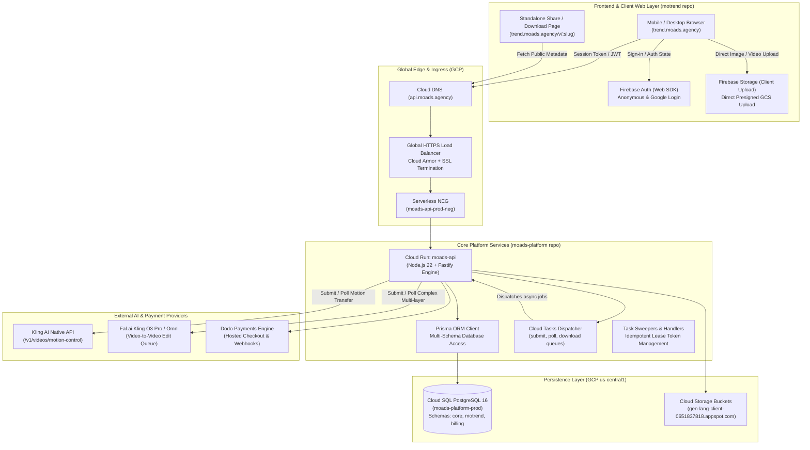

# MoTrend — Comprehensive Technical Architecture & Strategic Roadmap Specification

> **Version**: 2.4.0-prod  
> **Date**: September 21, 2026  
> **Status**: Production Deployed & Verified  
> **Repositories**:
> - Backend / Core Platform: `moads-platform` (`548483d`)
> - Frontend: `motrend` (`0921060`)  
> **Live Surfaces**:
> - Production Web: [https://trend.moads.agency/](https://trend.moads.agency/)  
> - Public API: `https://api.moads.agency/`  
> - Dev Staging Web: `https://trend-dev.moads.agency/`  
> - Dev API: `https://api-dev.moads.agency/`  

---

## 1. Executive Summary & Product Vision

### 1.1 What is MoTrend?
**MoTrend** is an AI-powered viral video generation platform that enables users to transform a single portrait photograph into a hyper-realistic, dynamic short-form video (meme, dance, cinematic trend) in vertical 9:16 format (TikTok, Instagram Reels, YouTube Shorts).

Users upload a photo, select a trending template or upload an arbitrary motion reference video, and the platform synthesizes a new video featuring the user performing the exact motion and choreography with original audio synchronized.

### 1.2 Core Value Proposition
- **Zero Skill Required**: No video editing, keyframing, or VFX expertise needed.
- **Viral Speed**: Turns viral internet trends into personalized, shareable meme videos within minutes.
- **Dual Operating Modes**:
  1. **Curated Template Mode**: Built-in viral trend library with pre-tuned prompt engineering, depth layers, audio tracks, and motion strength parameters.
  2. **Custom Reference Video Mode**: Users upload any MP4/MOV reference clip (up to 100MB), and the engine extracts motion to apply to the user's uploaded portrait, reconciling credit costs against the actual output duration.
- **Mobile-First Accessibility**: Specifically engineered for mobile browsers, including strict constrained in-app webviews (Telegram, Instagram, WhatsApp, TikTok).

---

## 2. End-to-End System Architecture



---

## 3. Detailed Component Breakdown

### 3.1 Frontend Web Layer (`motrend`)
- **Nature**: Lightweight, vanilla JavaScript SPA (HTML5, CSS3, ES6+ modules, zero heavy framework overhead).
- **Core Files**:
  - `public/index.html`: Main interface, semantic markup, responsive CSS, SVG icons.
  - `public/app.js`: Application controller (~5,500 LOC), managing state, DOM rendering, audio-enabled video players, touch gestures, carousel math, API communication, and Firebase SDK bindings.
  - `public/save-video.html` & `public/save-video.js`: Standalone, CSP-isolated viewer and download screen for direct saving, native Web Share API triggers, and social sharing.
  - `firebase.hosting.prod.json` / `firebase.hosting.dev.json`: Hosting configuration and clean redirect rules.
- **Mobile Responsive Engineering (Updated 2026-09-21)**:
  - **35% Reduced Video Height**: Under `@media (max-width: 640px)`, `.trendCard` width is scaled to `min(47vw, 182px)` (video height ~323px, down from ~498px), and `.customReferenceCard .tplMedia` max-width is set to `169px`. The vertical 9:16 aspect ratio is strictly preserved, preventing vertical screen crowding.
  - **Zero Right Space Alignment**: Right padding on `.trendCarouselTrack` is set to `0`, the right fade overlay (`::after`) is disabled on mobile, and the last card snaps flush (`shift = cRect.right - vRect.right`, 0px void) against the container boundary.
  - **Dynamic Card Snapping & Peek**: Hovering semi-obscured cards automatically rolls them into view with a 30% preview peek of the subsequent card. Once selected (`isSelected`), cards lock into position.
  - **Inline Audio Unmute**: Mobile video autoplay starts muted (mandated by WebKit/Blink policies); interactive taps smoothly toggle unmuted sound and synchronized looping.

### 3.2 Backend Service Layer (`moads-platform/services/api`)
- **Runtime**: Node.js 22 on Google Cloud Run (`moads-api-00073-8fx`).
- **Framework**: Fastify with high-performance JSON schema validation and structured logging.
- **Authentication**: Dual support for Firebase Auth JWTs and session cookies via `/auth/session-login`.
- **Primary MoTrend Endpoints**:
  - `GET /motrend/templates`: Returns active curated templates with credit costs, durations, and preview assets.
  - `GET /motrend/me`: Returns user credit balance, active jobs, and quota information.
  - `POST /motrend/jobs/prepare`: Validates user credits, creates an idempotent job in `AWAITING_UPLOAD`, and returns signed storage upload parameters.
  - `POST /motrend/jobs/finalize`: Verifies uploaded inputs, deducts credits atomically from the user's ledger, and queues the task for provider dispatch.
  - `GET /motrend/jobs/:id/refresh`: Live status check and polling fallback.
  - `POST /motrend/jobs/:id/prepare-download`: Generates a high-speed signed download URL or prepared clean video artifact.
  - `POST /motrend/jobs/:id/share`: Generates a viral public share slug for `/public/motrend/v/:slug`.

### 3.3 Asynchronous Queue Architecture (Cloud Tasks)
MoTrend utilizes Google Cloud Tasks to ensure resilient, non-blocking execution across external AI inference latencies (typically 2 to 5 minutes):
- **`motrend-submit-prod`**: Handles dispatching generation requests to Kling AI / Fal.ai with automatic retries and rate-limiting (2 dispatches/sec max).
- **`motrend-poll-prod`**: Periodically queries provider status with exponential backoff (10 dispatches/sec max, max 5 attempts per wave).
- **`motrend-download-prod`**: Downloads completed video streams from AI provider CDNs, stores them in Google Cloud Storage, reconciles actual video duration, and generates watermarked/clean download artifacts.

---

## 4. Comprehensive Data Model (Prisma / PostgreSQL)

Database schemas are strictly compartmentalized in PostgreSQL 16 (`moads-platform-prod`):
- `core`: User identity, accounts, memberships, support profiles.
- `motrend`: Templates, generation jobs, download artifacts, viral shares, job tasks.
- `billing`: Wallets, ledger transactions, checkout orders, payment subscriptions.

```prisma
// --- MOTREND SCHEMA ---

model MoTrendTemplate {
  id                String      @id @default(cuid()) @db.Text
  productId         String      @map("product_id") @db.Text
  code              String      @db.Text
  name              String      @db.Text
  isActive          Boolean     @default(true) @map("is_active")
  durationSec       Int         @default(10) @map("duration_sec")
  referenceVideoUrl String?     @map("reference_video_url") @db.Text
  metadataJson      Json?       @map("metadata_json")
  createdAt         DateTime    @default(now()) @map("created_at") @db.Timestamptz(6)
  updatedAt         DateTime    @updatedAt @map("updated_at") @db.Timestamptz(6)

  @@unique([productId, code])
  @@map("templates")
  @@schema("motrend")
}

model MoTrendJob {
  id                    String                @id @default(cuid()) @db.Text
  accountId             String                @map("account_id") @db.Text
  userId                String                @map("user_id") @db.Text
  templateId            String                @map("template_id") @db.Text
  selectionKind         MotrendSelectionKind  @map("selection_kind") // TEMPLATE or CUSTOM
  status                MotrendJobStatus      @default(AWAITING_UPLOAD)
  inputImagePath        String                @map("input_image_path") @db.Text
  inputImageUrl         String?               @map("input_image_url") @db.Text
  referenceVideoPath    String?               @map("reference_video_path") @db.Text
  referenceVideoUrl     String?               @map("reference_video_url") @db.Text
  debitedCredits        Int?                  @map("debited_credits")
  finalCostCredits      Int?                  @map("final_cost_credits")
  refundCredits         Int?                  @map("refund_credits")
  providerTaskId        String?               @map("provider_task_id") @db.Text
  providerState         String?               @map("provider_state") @db.Text
  providerOutputUrl     String?               @map("provider_output_url") @db.Text
  providerWatermarkUrl  String?               @map("provider_watermark_url") @db.Text
  billingSource         String?               @map("billing_source") @db.Text
  billingDurationSec    Int?                  @map("billing_duration_sec")
  billingRawDurationSec Float?                @map("billing_raw_duration_sec")
  outputDurationSec     Int?                  @map("output_duration_sec")
  outputRawDurationSec  Float?                @map("output_raw_duration_sec")
  reconciliationError   String?               @map("reconciliation_error") @db.Text
  finalizedAt           DateTime?             @map("finalized_at") @db.Timestamptz(6)
  lastStatusCheckAt     DateTime?             @map("last_status_check_at") @db.Timestamptz(6)
  metadataJson          Json?                 @map("metadata_json")
  createdAt             DateTime              @default(now()) @map("created_at") @db.Timestamptz(6)
  updatedAt             DateTime              @updatedAt @map("updated_at") @db.Timestamptz(6)

  account               Account               @relation(fields: [accountId], references: [id], onDelete: Cascade)
  user                  IdentityUser          @relation(fields: [userId], references: [id], onDelete: Cascade)
  jobRequests           MoTrendJobRequest[]
  downloadArtifacts     MoTrendDownloadArtifact[]
  publicShare           MoTrendPublicShare?
  tasks                 MoTrendJobTask[]

  @@index([accountId, status])
  @@index([userId, createdAt])
  @@map("jobs")
  @@schema("motrend")
}

model MoTrendJobTask {
  id           String            @id @default(cuid()) @db.Text
  jobId        String            @map("job_id") @db.Text
  taskType     MotrendTaskType   @map("task_type") // SUBMIT, POLL, DOWNLOAD
  status       MotrendTaskStatus @default(QUEUED)
  providerCode String            @default("kling") @map("provider_code") @db.Text
  operationKey String            @unique @map("operation_key") @db.Text
  notBeforeAt  DateTime          @default(now()) @map("not_before_at") @db.Timestamptz(6)
  claimedAt    DateTime?         @map("claimed_at") @db.Timestamptz(6)
  leaseUntil   DateTime?         @map("lease_until") @db.Timestamptz(6)
  processedAt  DateTime?         @map("processed_at") @db.Timestamptz(6)
  attempts     Int               @default(0)
  lastError    String?           @map("last_error") @db.Text
  payloadJson  Json?             @map("payload_json")
  createdAt    DateTime          @default(now()) @map("created_at") @db.Timestamptz(6)
  updatedAt    DateTime          @updatedAt @map("updated_at") @db.Timestamptz(6)
  job          MoTrendJob        @relation(fields: [jobId], references: [id], onDelete: Cascade)

  @@index([status, notBeforeAt])
  @@index([jobId, taskType, status])
  @@map("job_tasks")
  @@schema("motrend")
}

model MoTrendPublicShare {
  id              String      @id @default(cuid()) @db.Text
  jobId           String      @unique @map("job_id") @db.Text
  slug            String      @unique @db.Text
  title           String      @db.Text
  description     String      @db.Text
  previewImageUrl String?     @map("preview_image_url") @db.Text
  isActive        Boolean     @default(true) @map("is_active")
  createdAt       DateTime    @default(now()) @map("created_at") @db.Timestamptz(6)
  updatedAt       DateTime    @updatedAt @map("updated_at") @db.Timestamptz(6)
  job             MoTrendJob  @relation(fields: [jobId], references: [id], onDelete: Cascade)

  @@index([slug, isActive])
  @@map("public_shares")
  @@schema("motrend")
}
```

---

## 5. AI Video Generation Pipeline & Integration Details

### 5.1 Provider Architecture
MoTrend implements a hybrid multi-channel pipeline supporting:
1. **Direct Native Kling API (`https://api.klingai.com`)**:
   - Endpoint: `POST /v1/videos/motion-control`
   - Authentication: Custom HMAC-SHA256 JWT tokens generated dynamically on the server (`iss: accessKey`, 30 min expiration).
   - Payload:
     ```json
     {
       "video_url": "https://storage.googleapis.com/.../reference.mp4",
       "image_url": "https://storage.googleapis.com/.../input_photo.jpg",
       "mode": "std",
       "keep_original_sound": "yes",
       "character_orientation": "video",
       "external_task_id": "job_cuid..."
     }
     ```
2. **Kling Omni / O3 Pro via Fal.ai (`https://queue.fal.run`)**:
   - Endpoint: `POST /fal-ai/kling-video/o3/pro/video-to-video/edit`
   - Used for complex composition templates requiring multi-layer depth, character isolation, and strict occlusion locks (e.g. `yung_lean_storm2` where the target persona must replace a specific choir boy without occluding foreground dancers).
   - Negative prompt enforcement: Prevents hallucinated double heads, background morphing, facial distortion, and extra limbs.

### 5.2 Template Catalog Specifications
Currently active production templates:
| Template Code | Name | Duration | Credits | Provider / Pipeline | Specific Features |
| --- | --- | --- | --- | --- | --- |
| `yung_lean_storm2` | Yung Lean Storm II | 10s | 20 (2/s) | Kling Omni / Fal.ai | Strict crowd depth layers; photo background discard; front-row occlusion lock |
| `cwalk` | C-Walk Dance | 15s | 15 (1/s) | Kling Native Motion Control | Hip-hop footwork choreography transfer; dynamic camera tracking |
| `guan_yin` | Guan Yin Dance | 15s | 15 (1/s) | Kling Native Motion Control | Thousand-hand rhythmic arm synchronization; stage lighting retention |
| `bella` | Bella Trend | 10s | 10 (1/s) | Kling Native Motion Control | Viral head-bob rhythm meme; audio sync; portrait facial mimicry |

### 5.3 Duration & Ledger Reconciliation Engine
When a user uploads a custom video:
1. Client estimates duration and credits needed (`creditsPerSecond * durationSec`).
2. Credits are debited from the user's `Wallet` ledger as a pending debit.
3. Once Kling finishes, `motrend-download-prod` inspects the generated MP4 stream metadata (`ffprobe` / container headers).
4. **Automatic Reconciliation**: If the actual generated video is shorter than the estimated duration, the difference is automatically refunded back to the user's wallet. If generation fails or times out, a 100% full refund is executed.

---

## 6. Billing, Monetization & Payment Flow

- **Billing Engine**: Dodo Payments integration with multi-currency checkout.
- **Credit Economics**:
  - 1 Credit = 1 Second of standard motion generation.
  - Retail Pricing Packages:
    - Starter: 20 Credits / \$2.99 (~1-2 videos)
    - Creator: 60 Credits / \$6.99 (~4-6 videos)
    - Viral Pro: 150 Credits / \$14.99 (~10-15 videos)
  - Unit Cost Structure: Kling API cost averages \$0.05–\$0.08 per generated second, providing ~60–75% gross product margin.
- **Dodo Checkout Return Flow**:
  - User purchases credits on hosted checkout -> Redirects back to `trend.moads.agency/?checkout=complete&credits=XX`.
  - Frontend catches URL query parameters, automatically triggers `/motrend/me` refresh, displays a success banner, and pre-selects the previous draft.

---

## 7. Current Technical Limitations & Pain Points

1. **Inference Latency (2–5 Minutes)**:
   - Video-to-video diffusion and motion transfer require substantial GPU compute. Users waiting on mobile screens can close the browser or lose internet connection.
   - *Current Workaround*: Job status persists in the database; users can re-open the site to view completed videos.
2. **Polling Overhead vs. Webhooks**:
   - The system currently polls Kling status via Cloud Tasks waves every 10–15 seconds. Webhooks would reduce Cloud Tasks invocations and eliminate latency.
3. **Monolithic Vanilla JS (`app.js`)**:
   - At ~5,500 lines, `app.js` handles audio, video, gestures, carousel math, API calls, and modals in a single file. Refactoring into modular components (or a lightweight reactive setup) would improve extensibility.
4. **Identity & Facial Drift on Complex Angles**:
   - Single 2D photo input can suffer from identity morphing or distortion when reference motion involves rapid 360-degree head turns or extreme expressions.
5. **Static Template Ingestion**:
   - Adding new templates currently requires manual database seeding and asset upload to GCS. An automated ingestion pipeline is needed.

---

## 8. Strategic Roadmap & Research Angles for Gemini Exploration

This section outlines potential high-impact research trajectories for expanding MoTrend:

### 8.1 Multi-Model AI Routing & Fallback Infrastructure
- **Objective**: Dynamically route requests between different generative video engines based on cost, speed, motion complexity, and queue health.
- **Candidate Models**:
  - **Runway Gen-3 Alpha**: Superior photorealism, cinematic camera moves.
  - **Luma Dream Machine**: Extremely fast generation cycles (<90 seconds).
  - **MiniMax Hailuo Video**: High-coherence character physics and human anatomy.
  - **Wan 2.1 / Open-Source DiT**: Self-hosted on dedicated GPU pods (RunPod / Modal / GCP A100s) for zero per-generation API markup on high-volume viral spikes.

### 8.2 Identity Preservation & Pre-Processing Pipeline
- **Facial Landmark & InstantID Pre-Pass**:
  - Run an instant face-embedding / face-alignment step (e.g. InsightFace / PuLID / FaceID) before submitting to the motion model to produce a normalized, high-resolution portrait embed.
- **Multi-Photo Ingestion**:
  - Allow users to upload 2-3 angles (front, 45-degree angle, smiling) to construct a 3D-consistent facial representation.

### 8.3 Telegram Mini App (TMA) & Social Bot Channel
- **Why Telegram?**: MoTrend already has high traffic from mobile messengers.
- **TMA Advantages**:
  - Native in-app launch without browser cookie restrictions.
  - Native Telegram Stars micro-payments (one-tap instant payment with 0 friction).
  - Instant Telegram Bot push notifications when a video finishes generating ("Your viral dance is ready! 🚀").

### 8.4 Automated Viral Trend Radar & Ingestion Engine
- **Automated Trend Scraping**:
  - Ingest trending TikTok / Instagram Reels sounds and hashtags daily via API or scraping services.
  - Use AI pose-estimation (MediaPipe / DensePose) to evaluate whether a trend is suitable for motion transfer.
  - Automatically extract audio stems and segment 10-15s choreographies to create draft templates in PostgreSQL automatically.

### 8.5 Growth Loops, Virality & Community Feed
- **Viral Watermark / Outro**:
  - Optional free tier where the generated video has a stylish "Made with MoTrend" watermark/outro link.
- **Public Feed & 1-Click Remixing**:
  - Feed of anonymous user creations where visitors can tap "Remix this Trend" with their own photo in 1 click.
- **Affiliate & Creator Referral System**:
  - "Share your video: every friend who creates one gives you 15 free credits."

### 8.6 Frontend Evolution: Modular Component Architecture
- Transition from monolithic `app.js` to a modern, zero-overhead bundler (e.g. Vite + Preact or Svelte).
- Retain sub-second FCP loading performance while gaining state management (Zustand / Signals) and modular component isolation.

---

## 9. Key Repository Paths & Reference Map

| Component | Path | Description |
| --- | --- | --- |
| **API Endpoints** | `services/api/src/routes/motrend.ts` | Fastify routes for templates, jobs, downloads, shares |
| **Kling Provider** | `services/api/src/lib/motrend-provider.ts` | Direct Kling & Fal.ai integration, JWT generation, polling |
| **Queue Tasks** | `packages/db/src/motrend-tasks.ts` | Cloud Tasks dispatcher and lease-handling logic |
| **Database Models** | `packages/db/prisma/schema.prisma` | PostgreSQL schemas for core, motrend, billing |
| **Frontend UI** | `motrend/public/index.html` | Markup, mobile responsive CSS, layout |
| **Frontend Logic** | `motrend/public/app.js` | UI controller, carousel math, video players, auth |
| **Viewer Page** | `motrend/public/save-video.html` | Standalone download and viral sharing screen |
| **Prod State Docs** | `docs/platform-current-state.md` | Canonical environment inventory and commit anchors |
